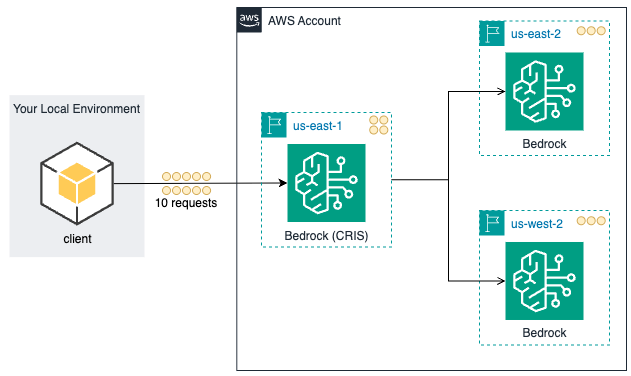
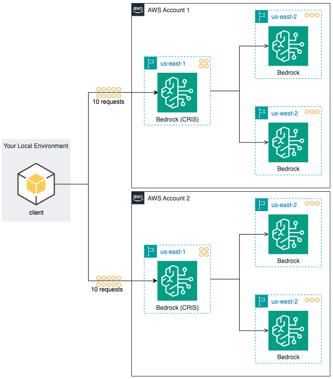
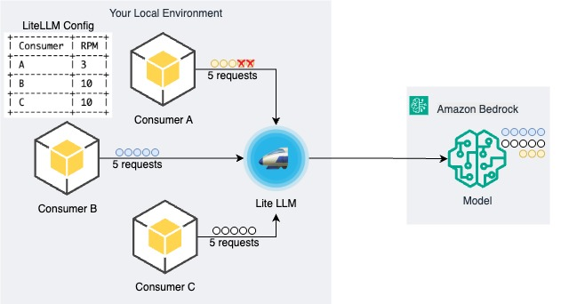

# Improving Resilience of Generative AI Applications with a LLM Gateway and Amazon Bedrock

As organizations scale from simple chatbots to complex agentic AI systems—where a single request triggers dozens of model calls—traditional approaches to managing LLM capacity fall short.

This repository contains companion code for the AWS blog post BLOG_POST_URL, demonstrating a progressive "crawl, walk, run" strategy for building resilient GenAI applications on AWS. We cover 5 different patterns, starting with Amazon Bedrock cross-Region inference for basic load distribution, advancing to AWS account sharding for quota isolation between teams, and culminating in a centralized gateway that provides intelligent routing across multiple providers, application-level rate limiting, and enterprise governance.

To illustrate these concepts, this project uses [LiteLLM](https://docs.litellm.ai/) as a reference implementation, though organizations can implement similar patterns using other gateway solutions, custom applications, or AWS services. For more robust deployments, organizations should consider the [AWS Solutions Guidance for Multi-Provider Generative AI Gateway](https://aws.amazon.com/solutions/guidance/multi-provider-generative-ai-gateway-on-aws/) which provides enterprise-grade features including deploying the gateway on Amazon ECS or EKS, SSL/TLS certificates via AWS Certificate Manager, web application firewall protection with AWS WAF, caching with Amazon ElastiCache, and secrets management with AWS Secrets Manager.

## Prerequisites

### Required Software
- [uv](https://docs.astral.sh/uv/getting-started/installation/) - Python package manager (automatically installs Python 3.12 per `.python-version`)
- [AWS CLI](https://docs.aws.amazon.com/cli/latest/userguide/cli-chap-getting-started.html) configured with appropriate credentials (see AWS Configuration below)

### AWS Configuration
1. **AWS Account**: An active account with [Amazon Bedrock access](https://docs.aws.amazon.com/bedrock/latest/userguide/setting-up.html). For the account sharding demo, you'll need access to two AWS accounts, both configured with all the requirements described in items 2-4 below. Enable the following models in each account:
    - Anthropic Claude 3.7 Sonnet and Claude Sonnet 4
2. **AWS Profile & Region**: The project reads AWS configuration from `config/config.yaml`. First, update the profile name and Region in `config/config.yaml` to match your setup, then ensure your [AWS profile credentials are configured](https://docs.aws.amazon.com/cli/latest/userguide/cli-configure-profiles.html) before running the demos. The gateway and demo scripts will automatically use the profile and Region specified in `config/config.yaml`. For multi-account deployments, follow [AWS multi-account best practices](https://docs.aws.amazon.com/whitepapers/latest/organizing-your-aws-environment/organizing-your-aws-environment.html).
   - A sample least-privilege IAM policy needed to run all the demos is provided in [`iam/policy.json`](iam/policy.json). Replace `<REGION>` and `<ACCOUNT_ID>` placeholders with your specific values before applying. Note that the values might change if you modify the default configuration values in `config/config.yaml`.
3. **Enable Amazon Bedrock cross-Region inference**: Configure [cross-Region inference](https://docs.aws.amazon.com/bedrock/latest/userguide/cross-Region-inference.html) in your AWS account to allow automatic distribution of requests across multiple AWS Regions for improved availability and throughput.
4. **Enable CloudWatch Logging for Bedrock**: Enable [model invocation logging](https://docs.aws.amazon.com/bedrock/latest/userguide/model-invocation-logging.html) in Amazon Bedrock and create the CloudWatch log group in the same Region as your Bedrock configuration. Set the log group name in `config/config.yaml` under `aws.bedrock_log_group_name` (default: "BedrockModelInvocation"). Ensure your AWS profile has the required permissions:
        - `bedrock:InvokeModel` on the following model families:
            - `us.anthropic.claude-3-7-sonnet-*`
            - `us.anthropic.claude-sonnet-4-*`
            - `us.anthropic.claude-3-5-sonnet-*`
            - `us.amazon.nova-*`
        - `logs:StartQuery`, `logs:GetQueryResults`, `logs:DescribeQueries`, `logs:DescribeLogGroups` for CloudWatch Logs

## Installation

```bash
# Clone and setup project
git clone https://github.com/aws-samples/sample-resilient-llm-inference.git
cd sample-resilient-llm-inference

# Install dependencies (uv will create virtual environment automatically)
uv sync  # This installs all dependencies from pyproject.toml including litellm, openai, and boto3

# Make scripts executable
chmod +x ./bin/start-gateway.sh
```

## Testing All Resilience Patterns

Open a new terminal window that you will use to run the test scripts below. Keep the Lite LLM gateway running on your original terminal during all the tests.

### 1. Amazon Bedrock Cross-Region Inference (CRIS)

This demo showcases [Amazon Bedrock cross-Region inference](https://docs.aws.amazon.com/bedrock/latest/userguide/cross-Region-inference.html), which automatically distributes requests across multiple AWS Regions for improved availability and throughput. The demo sends 10 concurrent requests to a single cross-Region inference endpoint, using us-east-1 by default (configurable in `config/config.yaml`) as the source Region.



| Model Endpoint| # Requests Sent |
|-------|---------|
| us.anthropic.claude-sonnet-4-20250514-v1:0 | 10 |

After sending the requests, the demo queries Amazon CloudWatch Logs to visualize how Amazon Bedrock automatically distributed them across multiple AWS Regions without any additional configuration. The Regional distribution varies based on [real-time factors](https://docs.aws.amazon.com/bedrock/latest/userguide/cross-Region-inference.html) including traffic, demand, and resource utilization. Cross-Region inference profiles route requests based on the source Region, so check [supported Regions and models](https://docs.aws.amazon.com/bedrock/latest/userguide/inference-profiles-support.html) for specific routing details.

**Note**: This demo requires Amazon Bedrock model invocation logging to be enabled and configured to send logs to Amazon CloudWatch Logs. This allows the demo to query Regional distribution data. The CloudWatch log group name is configurable in `config/config.yaml` under `aws.bedrock_log_group_name` (default: "BedrockModelInvocation").

```bash
uv run python src/demo_cris.py --requests 10
```

The command output will show Regional distribution similar to the example below (actual distribution may vary):

```bash
Region       | Invocations | Percentage
-------------|-------------|------------
us-east-1    |           3 |      30.0%
us-east-2    |           5 |      50.0%
us-west-2    |           2 |      20.0%
================================================================================
```

### 2. AWS Account Sharding

This demo demonstrates account sharding as a strategy for scaling GenAI applications beyond single-account quotas. By distributing requests across multiple AWS accounts, organizations can effectively multiply their available throughput and prevent issues in one account from affecting others. The demo sends 20 concurrent requests (10 per account) using round-robin distribution.



```bash
uv run python src/demo_account_sharding.py --requests 20
```

The command output shows the account sharding in action:

```bash
================================================================================
ACCOUNT SHARDING ANALYSIS
================================================================================

----------------------------------------------------------------------
Account    | Total | Success | Failed | Success Rate | Avg Time
-----------|-------|---------|--------|--------------|----------
ACCOUNT1   |    10 |      10 |      0 |       100.0% |    3.96s
ACCOUNT2   |    10 |      10 |      0 |       100.0% |    3.47s
----------------------------------------------------------------------
TOTAL      |    20 |      20 |      0 |       100.0% |    3.72s

ACCOUNT1:
-------------|-------------|------------
Region       | Invocations | Percentage
-------------|-------------|------------
us-east-1    |           1 |      10.0%
us-east-2    |           3 |      30.0%
us-west-2    |           6 |      60.0%

ACCOUNT2:
-------------|-------------|------------
Region       | Invocations | Percentage
-------------|-------------|------------
us-east-2    |           8 |      80.0%
us-west-2    |           2 |      20.0%
```

The results demonstrate how cross-Region inference operates within each account independently, distributing requests across Regions based on real-time capacity. This account sharding approach can significantly increase available throughput by utilizing quotas from multiple accounts. AWS accounts provide isolation boundaries that help contain potential risks, though organizations must implement appropriate [security controls](https://aws.amazon.com/compliance/shared-responsibility-model/) for their specific requirements. This strategy enables quota allocation where AWS service quotas are enforced separately for each account, preventing workloads from consuming quotas for each other, while supporting different teams with their different responsibilities and resource needs. Organizations also benefit from billing separation to directly map costs to underlying projects.

## Generative AI Gateway Configuration

For the next 3 patterns we will need to start our LiteLLM Gateway. The project uses a single configuration file, [**config.yaml**](config/config.yaml), which contains the LiteLLM proxy configuration. All model endpoints use **Amazon Bedrock cross-Region inference (CRIS)**, which automatically distributes requests across multiple AWS Regions to provide an additional layer of capacity and availability.

## Starting the Gateway

Open a terminal window and start the gateway server. **Keep this terminal running** throughout the resilience patterns 3-5:

```bash
./bin/start-gateway.sh
```

The gateway will start on port 4000 by default (configurable in `config/config.yaml`). Leave this process running and use a separate terminal for executing the demonstration scripts below.

### 3. LiteLLM Fallback

This demo illustrates automatic fallback behavior when specific application requests against a specific model reach their rate limits. The configuration uses a primary model with an intentionally low 3 requests per minute (RPM) limit and a fallback model with higher capacity:


| Model | Max RPM | Type | Purpose |
|-------|---------|------|---------|
| us.anthropic.claude-sonnet-4-20250514-v1:0 | 3 | Primary | Low limit to trigger fallback |
| us.anthropic.claude-3-5-sonnet-20241022-v2:0 | 25 | Fallback | Higher capacity backup |

The demo sends 10 concurrent requests to overwhelm the primary model's capacity. You'll see 3 requests handled by the primary Claude Sonnet 4 model, with the remaining 7 automatically routed to the fallback Claude Sonnet 3.5 model. All 10 requests complete successfully, demonstrating improved availability through fallback mechanisms despite rate limits being breached (note: actual availability depends on proper implementation of [resilience patterns](https://aws.amazon.com/builders-library/reliability-pillar/) and underlying service health).

```bash
uv run python src/demo_fallback.py
```

Sample output showing fallback in action:

```bash
[14:36:24.947] Request # 2 → PRIMARY:  Model: us.anthropic.claude-sonnet-4-20250514-v1:0    | Time:  6.03s
[14:36:25.770] Request # 1 → PRIMARY:  Model: us.anthropic.claude-sonnet-4-20250514-v1:0    | Time:  6.90s
[14:36:27.621] Request # 4 → FALLBACK! Model: us.anthropic.claude-3-5-sonnet-20241022-v2:0  | Time:  8.60s
[14:36:28.050] Request # 3 → PRIMARY:  Model: us.anthropic.claude-sonnet-4-20250514-v1:0    | Time:  9.08s
[14:36:29.157] Request # 5 → FALLBACK! Model: us.anthropic.claude-3-5-sonnet-20241022-v2:0  | Time: 10.08s
[14:36:29.330] Request # 8 → FALLBACK! Model: us.anthropic.claude-3-5-sonnet-20241022-v2:0  | Time: 10.09s
[14:36:33.480] Request # 6 → FALLBACK! Model: us.anthropic.claude-3-5-sonnet-20241022-v2:0  | Time: 14.35s
[14:36:36.013] Request # 9 → FALLBACK! Model: us.anthropic.claude-3-5-sonnet-20241022-v2:0  | Time: 16.71s
[14:36:40.322] Request # 7 → FALLBACK! Model: us.anthropic.claude-3-5-sonnet-20241022-v2:0  | Time: 21.14s
[14:36:42.028] Request #10 → FALLBACK! Model: us.anthropic.claude-3-5-sonnet-20241022-v2:0  | Time: 22.68s

================================================================================
FALLBACK DEMONSTRATION RESULTS
================================================================================
Total Requests:        10
Successful:            10
Failed:                0
Primary Model Used:    3
Fallback Triggered:    7

Model Usage Distribution:
  FALLBACK us.anthropic.claude-3-5-sonnet-20241022-v2:0 :  7 requests ( 70.0%)
  PRIMARY  us.anthropic.claude-sonnet-4-20250514-v1:0   :  3 requests ( 30.0%)

[14:36:42.029] FALLBACK WORKING: 7 requests successfully failed over to Sonnet 3.5 models!
```

The results show that once LiteLLM detects the primary Claude Sonnet 4 model has exceeded its configured RPM limits, the remaining requests automatically route to the fallback Claude Sonnet 3.5. This demonstrates the gateway's ability to maintain 100% success rates during rate limit scenarios through intelligent fallback routing.

### 4. LiteLLM Load Balancing

This demo demonstrates how LiteLLM's `simple-shuffle` routing strategy distributes requests across multiple model instances for optimal resource utilization. The configuration includes two primary models with limited capacity and a fallback model for overflow:


| Model | Max RPM | Type | Purpose |
|-------|---------|------|---------|
| us.anthropic.claude-3-7-sonnet-20250219-v1:0 | 3 | Primary | Load balanced instance 1 |
| us.anthropic.claude-sonnet-4-20250514-v1:0 | 3 | Primary | Load balanced instance 2 |
| us.anthropic.claude-3-5-sonnet-20241022-v2:0 | 25 | Fallback | Overflow capacity |

When sending 10 concurrent requests, the simple-shuffle algorithm randomly distributes them across both primary models (6 RPM combined capacity). Once these models reach their limits, the remaining 4 requests automatically route to the fallback model, ensuring all requests are served successfully.

```bash
uv run python src/demo_load_balancing.py
```

Sample output showing distribution across models:

```bash
================================================================================
LOAD BALANCING RESULTS
================================================================================
Total Requests:     10
Successful:         10
Failed:             0

Model Distribution:
  us.anthropic.claude-3-5-sonnet-20241022-v2:0       :  4 requests ( 40.0%)
  us.anthropic.claude-3-7-sonnet-20250219-v1:0       :  3 requests ( 30.0%)
  us.anthropic.claude-sonnet-4-20250514-v1:0         :  3 requests ( 30.0%)

[19:08:08.723] LOAD BALANCING WORKING: Requests distributed across multiple models!
```

### 5. LiteLLM Consumer/Quota Isolation

This demo shows how quota isolation prevents "noisy neighbor" problems in multi-tenant environments. Each consumer uses the same underlying Claude 3.7 Sonnet model but with independent rate limiting buckets at the gateway level:



| Consumer | Model | Max RPM | Type | Purpose |
|----------|-------|---------|------|---------|
| Consumer A | us.anthropic.claude-3-7-sonnet-20250219-v1:0 | 3 | Noisy | Simulates aggressive consumer |
| Consumer B | us.anthropic.claude-3-7-sonnet-20250219-v1:0 | 10 | Normal | Regular application workload |
| Consumer C | us.anthropic.claude-3-7-sonnet-20250219-v1:0 | 10 | Normal | Regular application workload |

The demo simulates a real-world scenario where all three consumers send 5 parallel requests simultaneously. Consumer A, with its 3 RPM limit, can only process 3 requests successfully before being rate-limited. Meanwhile, Consumers B and C, with their 10 RPM quotas, successfully process all their requests. This proves that one consumer's aggressive behavior cannot affect the quality of service for other consumers.

```bash
uv run python src/demo_quota_isolation.py
```

Sample output showing effective isolation:

```bash
[19:09:18.378] Starting consumers...
[19:09:20.436] B | SUCCESS      | Req # 2 | 1.48s
[19:09:20.585] C | SUCCESS      | Req # 2 | 1.62s
[19:09:20.706] C | SUCCESS      | Req # 1 | 1.75s
[19:09:20.789] A | SUCCESS      | Req # 1 | 1.84s
[19:09:20.842] C | SUCCESS      | Req # 3 | 1.88s
[19:09:20.852] B | SUCCESS      | Req # 1 | 1.89s
[19:09:20.933] B | SUCCESS      | Req # 3 | 1.97s
[19:09:20.996] A | SUCCESS      | Req # 2 | 2.04s
[19:09:21.133] A | SUCCESS      | Req # 4 | 2.18s
[19:09:21.395] C | SUCCESS      | Req # 4 | 2.44s
[19:09:22.037] B | SUCCESS      | Req # 5 | 3.08s
[19:09:22.183] B | SUCCESS      | Req # 4 | 3.24s
[19:09:26.576] C | SUCCESS      | Req # 5 | 7.61s
[19:09:29.257] A | RATE LIMITED | Req # 5
[19:09:31.480] A | RATE LIMITED | Req # 3
[19:09:31.480] Demo completed in 13.1 seconds

========================================================================================
QUOTA ISOLATION ANALYSIS
========================================================================================
Consumer   | Type   | Success Rate | Total | Success | Failed | Rate Limited | Avg Time
-----------+--------+--------------+-------+---------+--------+--------------+---------
A        | NOISY  |  60.0%        |     5 |       3 |      2 |            2 |    2.02s
B        | NORMAL | 100.0%        |     5 |       5 |      0 |            0 |    2.33s
C        | NORMAL | 100.0%        |     5 |       5 |      0 |            0 |    3.06s
```


The demo shows Consumer A (noisy) achieved only 60% success rate due to rate limiting, while Consumers B and C (normal) maintained 100% success rates. This demonstrates how proper quota management at the gateway level ensures fair resource allocation and prevents any single consumer from monopolizing the available capacity.

## Cleanup

After completing the demonstrations, follow these steps to clean up your resources:

### 1. Stop the Gateway
```bash
# Stop the LiteLLM gateway if still running
# Press Ctrl+C in the terminal running the gateway
```

### 2. AWS CloudWatch Logs
To clean up CloudWatch log data created by Bedrock model invocations, see the AWS documentation on [deleting log groups and log streams](https://docs.aws.amazon.com/AmazonCloudWatch/latest/logs/Working-with-log-groups-and-streams.html#DeleteLogStream). Additionally, you can disable [Amazon Bedrock model access logs](https://docs.aws.amazon.com/bedrock/latest/userguide/model-invocation-logging.html) if no longer needed.

## Legal Disclaimers and Risk Assessment

**⚠️ IMPORTANT DISCLAIMERS:**
- This code is for demonstration purposes only. Do not use this configuration in production environments
- This demonstration code is provided "as is" for educational purposes only
- Users are responsible for compliance with [AWS Service Terms](https://aws.amazon.com/service-terms/), [AWS Acceptable Use Policy](https://aws.amazon.com/aup/), and all applicable regulatory requirements
- Third-party components (LiteLLM, OpenAI SDK) are subject to their respective licenses and terms of service
- Users must conduct their own security and compliance assessments before any production deployment
- This project demonstrates technical patterns only and does not constitute security, legal, or compliance advice

For production deployments, organizations must implement appropriate security controls following the [AWS Shared Responsibility Model](https://aws.amazon.com/compliance/shared-responsibility-model/).

## Security

See [CONTRIBUTING](CONTRIBUTING.md#security-issue-notifications) for more information.

## License

This project is licensed under the MIT-0 License. See the LICENSE file.

